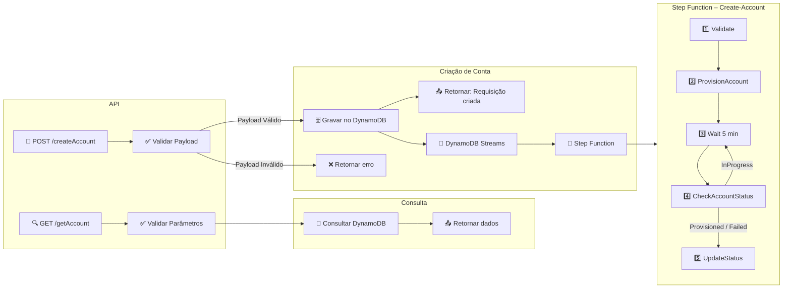

# Accounts API — Automação de Criação de Contas AWS

API CRUD que orquestra a criação de contas AWS via Control Tower/Service Catalog: recebe requisições REST, valida/normaliza dados, grava no DynamoDB e dispara a Step Function responsável por provisionar e acompanhar cada conta.

## Objetivo
Permitir que os fluxos de automação da companhia incluam a criação de contas AWS através de uma API REST única, eliminando etapas manuais do Control Tower e garantindo validações, rastreabilidade e atualização de status em tempo real.

## Documentação principal
- Consulte [documentation.md](documentation.md) para arquitetura completa, payloads, IAM e fluxos detalhados.
- Licença: [MIT](LICENSE).


## Arquitetura e Fluxo



---

## Visão rápida da solução
- **POST `/createAccount`** → valida payload, impede duplicidades e grava no DynamoDB (`Status=Requested`).
- **GET `/getAccount`** → consulta pelo `accountEmail` ou `accountId`.
- **Step Function** → `Validate → ProvisionAccount → CheckAccountStatus (loop 5min, máx. 20x) → UpdateSuccess/Failed`.
- **Observabilidade** → CloudWatch Logs (API Gateway + Lambdas) e `RequestID` propagado para correlacionar eventos.

## Estrutura do repositório
- `lambda_src/api/lambda_function.py` — handler HTTP (GET/POST).
- `lambda_src/accounts/*.py` — Lambdas do fluxo (validação, provisionamento, atualização de status, trigger da SFN).
- `terraform/` — infraestrutura (DynamoDB, Lambdas, IAM, API Gateway, Step Function).
- `tests/` — ponto inicial para cenários unitários/integração.

## Pré-requisitos / Dependências
- Credenciais AWS com permissão para DynamoDB, Organizations, Service Catalog, Step Functions e CloudWatch.
- Python 3.11+ e Make (para rodar `make test`, `make tf-plan`, etc.).
- Variáveis obrigatórias:
  - `DYNAMO_TABLE` — nome exato da tabela; definido pelo Terraform para todos os Lambdas.
  - `SFN_ARN` — ARN da State Machine usada pelo fluxo (API usa para checar disponibilidade).
  - `SFN_MAX_CONCURRENT` — limite de execuções concorrentes aceitas antes de retornar 429 (default `5`).

## Deploy via Terraform
1. **Deploy manual**: `cd terraform && terraform init && terraform apply`.
2. **API pública**: deixe `api_gateway_vpc_id` vazio e execute `make tf-deploy` (init + apply).
3. **API privada**: defina `api_gateway_vpc_id`, `api_gateway_vpc_subnet_ids` e `api_gateway_vpc_allowed_cidrs`, depois `make tf-deploy`. O módulo cria o VPC endpoint Interface automaticamente e restringe acesso via `aws:SourceVpce`.  
4. Após o apply, use o script `scripts/awscurl.sh` para requisitar/validar o endpoint (público ou privado conforme o ambiente).  

## Bootstrap de contas já existentes
- O Terraform cria uma associação SSM (`AWS-InvokeLambdaFunction`) que roda a Lambda `bootstrap-accounts` semanalmente (cron `0 5 ? * MON *`). A primeira execução ocorre logo após o deploy, preenchendo o DynamoDB com as contas atuais do Organizations.
- Para uma execução manual (ex.: após ajustes), invoque diretamente:

```bash
cd terraform
LAMBDA_NAME=$(terraform output -raw bootstrap_accounts_lambda_name)
aws lambda invoke --function-name "$LAMBDA_NAME" bootstrap-output.json
cat bootstrap-output.json   # exibe o resumo (inserted/failed)
```

Repita o comando sempre que precisar sincronizar novamente.

## Como testar a API rapidamente
- **Campos obrigatórios no POST**: `AccountEmail`, `AccountName`, `OrgUnit`, `SSOUserEmail`, `SSOUserFirstName`, `SSOUserLastName`. `Tags` é opcional (lista `{ "Key": "...", "Value": "..." }`).
- **GET `/getAccount`**: passe `accountEmail` ou `accountId` por query-string.
- **Script utilitário**: `scripts/awscurl.sh` encapsula chamadas já assinadas com SigV4 (usa `awscurl`). Ele aceita payload único ou lista (até 5 entradas) e consegue extrair `AccountEmail`/`AccountId` automaticamente do JSON para chamadas GET.  
  ```bash
  ./scripts/awscurl.sh \
    --mode post \
    --payload payload.json \
    AWS_REGION=us-east-1 REST_API_ID=xxxxxxxx
  ```
  - flags disponíveis: `--mode post|get`, `--email foo@bar.com`, `--id 123456789012`, `--payload arquivo.json`; `--help` mostra o uso completo. Caso nenhuma flag de e-mail/ID seja informada, o script tenta usar os campos `AccountEmail`/`AccountId` do payload (primeira entrada).  
  - variáveis `AWS_REGION`, `REST_API_ID`, `API_STAGE`, `API_RESOURCE_PATH` podem ser informadas via env.
- Exemplo de payload (`payload.json`):
  ```json
  [
    {
      "SSOUserEmail": "user1@empresa.com",
      "SSOUserFirstName": "Paulo",
      "SSOUserLastName": "Silva",
      "OrgUnit": "Sandbox",
      "AccountName": "sandbox-01",
      "AccountEmail": "sandbox-01@empresa.com"
    },
    {
      "SSOUserEmail": "user2@empresa.com",
      "SSOUserFirstName": "Ana",
      "SSOUserLastName": "Souza",
      "OrgUnit": "Sandbox",
      "AccountName": "sandbox-02",
      "AccountEmail": "sandbox-02@empresa.com"
    }
  ]
  ```
- Exemplo de GET rápido:
  ```bash
  ./scripts/awscurl.sh \
    --mode get \
    --email sandbox-01@empresa.com \
    AWS_REGION=us-east-1 REST_API_ID=xxxxxxxx
  ```
- **Chamada direta com awscurl**:
  ```bash
  awscurl --region us-east-1 --service execute-api \
    --request POST --header "Content-Type: application/json" \
    --data @payload.json \
    https://<rest_api_id>.execute-api.<região>.amazonaws.com/prod/accounts
  ```
