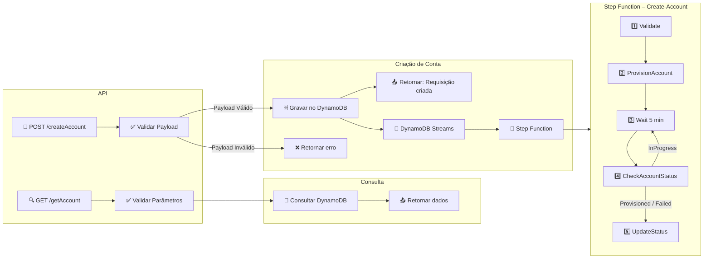

# Accounts API — Automação de Criação de Contas AWS

API CRUD que orquestra a criação de contas AWS via Control Tower/Service Catalog: recebe requisições REST, valida/normaliza dados, grava no DynamoDB e dispara a Step Function responsável por provisionar e acompanhar cada conta.

## Objetivo
Permitir que os fluxos de automação da companhia incluam a criação de contas AWS através de uma API REST única, eliminando etapas manuais do Control Tower e garantindo validações, rastreabilidade e atualização de status em tempo real.

## Documentação principal
- Consulte [documentation.md](documentation.md) para arquitetura completa, payloads, IAM e fluxos detalhados.

## Arquitetura e Fluxo

---

## Visão rápida da solução
- **POST `/createAccount`** → valida payload, impede duplicidades e grava no DynamoDB (`Status=Requested`).
- **GET `/getAccount`** → consulta pelo `accountEmail` ou `accountId`.
- **Step Function** → `Validate → ProvisionAccount → CheckAccountStatus (loop 5min, máx. 20x) → UpdateSuccess/Failed`.
- **Observabilidade** → CloudWatch Logs (API Gateway + Lambdas) e `RequestID` propagado para correlacionar eventos.

## Estrutura do repositório
- `lambda_src/api/lambda_function.py` — handler HTTP (GET/POST).
- `lambda_src/accounts/*.py` — Lambdas do fluxo (validação, provisionamento, atualização de status, trigger da SFN).
- `terraform/` — infraestrutura (DynamoDB, Lambdas, IAM, API Gateway, Step Function).
- `tests/` — ponto inicial para cenários unitários/integração.

## Pré-requisitos / Dependências
- Credenciais AWS com permissão para DynamoDB, Organizations, Service Catalog, Step Functions e CloudWatch.
- Python 3.11+ e Make (para rodar `make test`, `make tf-plan`, etc.).
- Variáveis obrigatórias:
  - `DYNAMO_TABLE` — nome exato da tabela; definido pelo Terraform para todos os Lambdas.
  - `SFN_ARN` — ARN da State Machine usada pelo fluxo (API usa para checar disponibilidade).
  - `SFN_MAX_CONCURRENT` — limite de execuções concorrentes aceitas antes de retornar 429 (default `5`).

## Deploy via Terraform
1. `cd terraform && terraform init` (primeira vez)  
2. **API pública**: mantenha `api_gateway_vpc_id` vazio e execute `terraform apply`.  
3. **API privada**: defina `api_gateway_vpc_id`, `api_gateway_vpc_subnet_ids` e `api_gateway_vpc_allowed_cidrs`, depois `terraform apply`. O módulo cria o VPC endpoint Interface automaticamente e a policy limita o acesso ao VPCE.  
4. Após o apply, rode `../test_awscurl.sh` para testar com o host público (ou, no caso privado, usando o DNS do VPCE).  
