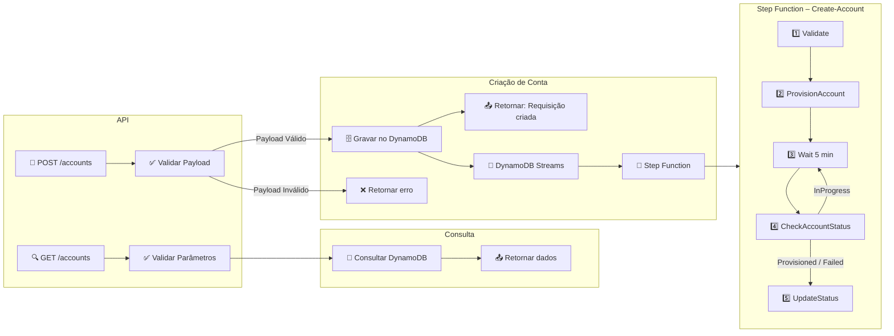

# Accounts API — Automação de Criação de Contas AWS

[](https://github.com/DavidFerreira21/api-account-factory/actions/workflows/ci.yml)
**Release atual:** `v1.0.0`


## Objetivo
Automatizar a criação de contas AWS por API REST, removendo etapas manuais no Control Tower/Service Catalog e permitindo integração direta com pipelines DevOps e workflows de automação corporativa (portais internos, ITSM, CI/CD e orquestradores).

Com a solução, o processo passa a ser:
- Entrada padronizada via API (`POST /accounts`).
- Validação e persistência com rastreabilidade (`RequestID`, status e timestamps).
- Provisionamento assíncrono e observável por Step Functions.
- Consulta de estado por API (`GET /accounts` com `accountEmail` ou `accountId`).

## Documentação principal
- Consulte [documentation.md](documentation.md) para arquitetura completa, payloads, IAM e fluxos detalhados.
- Licença: [MIT](LICENSE).
- Contribuição: [CONTRIBUTING.md](CONTRIBUTING.md)
- Conduta: [CODE_OF_CONDUCT.md](CODE_OF_CONDUCT.md)
- Segurança: [SECURITY.md](SECURITY.md)
- Histórico de mudanças: [CHANGELOG.md](CHANGELOG.md)

## Quick Start
1. Clone o repositório:
   ```bash
   git clone <url-do-repo>
   cd api-account-factory
   ```
2. Pré-requisitos:
   ```bash
   python3 --version
   terraform version
   aws sts get-caller-identity
   ```
3. Prepare variáveis Terraform:
   ```bash
   cp terraform/terraform.tfvars.example terraform/terraform.tfvars
   ```
4. Deploy:
   ```bash
   make tf-apply
   cd terraform
   REST_API_ID=$(terraform output -raw api_rest_api_id)
   cd ..
   ```
5. Criar conta via API (POST):
   ```bash
   cat > /tmp/test-account.json <<'EOF'
   {
     "SSOUserEmail": "qa.teste@empresa.com",
     "SSOUserFirstName": "QA",
     "SSOUserLastName": "Teste",
     "OrgUnit": "Sandbox",
     "AccountName": "conta-teste-001",
     "AccountEmail": "conta-teste-001@empresa.com",
     "Tags": [
       { "Key": "Ambiente", "Value": "Test" }
     ]
   }
   EOF
   AWS_REGION=us-east-1 REST_API_ID="$REST_API_ID" API_STAGE=prod API_RESOURCE_PATH=/accounts \
   bash scripts/awscurl.sh --mode post --payload /tmp/test-account.json
   ```
6. Consultar conta via API (GET):
   ```bash
   AWS_REGION=us-east-1 REST_API_ID="$REST_API_ID" API_STAGE=prod API_RESOURCE_PATH=/accounts \
   bash scripts/awscurl.sh --mode get --email conta-teste-001@empresa.com
   ```
7. Testes:
   ```bash
   make test
   ```
8. Destroy:
   ```bash
   make tf-destroy
   ```

## Boas práticas para repositório público
- Não versione `terraform/terraform.tfvars` real de ambiente.
- Use `terraform/terraform.tfvars.example` com placeholders.
- Não versione artefatos locais (`.tfstate`, `.terraform/`, zips de empacotamento Lambda, outputs locais).

## Governança Open Source
- Pull requests e padrão de contribuição: [CONTRIBUTING.md](CONTRIBUTING.md).
- Regras de convivência: [CODE_OF_CONDUCT.md](CODE_OF_CONDUCT.md).
- Reporte responsável de vulnerabilidades: [SECURITY.md](SECURITY.md).
- Histórico de evolução: [CHANGELOG.md](CHANGELOG.md).

## Arquitetura e Fluxo


```mermaid
flowchart LR

subgraph API[API]
    getAccount[🔍 GET /accounts] --> validaParametros[✅ Validar Parâmetros]
    createAccount[📝 POST /accounts] --> validaPayload[✅ Validar Payload]
end

subgraph Consulta[Consulta]
    validaParametros --> consultaDynamo[📂 Consultar DynamoDB]
    consultaDynamo --> retornaDados[📤 Retornar dados]
end

subgraph Criação[Criação de Conta]
    validaPayload -->|Payload Válido| gravaDynamo[🗄️ Gravar no DynamoDB]
    validaPayload -->|Payload Inválido| retornoErro[❌ Retornar erro]
    gravaDynamo --> requisicaoCriada[📤 Retornar: Requisição criada]
    gravaDynamo --> streamDynamo[🔁 DynamoDB Streams]
    streamDynamo --> stepFunction[🧩 Step Function]
end

subgraph StepFunction[Step Function – Create-Account]
    stepValidate[1️⃣ Validate] --> stepProvision[2️⃣ ProvisionAccount]
    stepProvision --> wait5[3️⃣ Wait 5 min]
    wait5 --> stepCheck[4️⃣ CheckAccountStatus]
    stepCheck -->|InProgress| wait5
    stepCheck -->|Provisioned / Failed| stepUpdate[5️⃣ UpdateStatus]
end

stepFunction --> StepFunction
```

---

## Visão rápida da solução
- **POST `/accounts`** → valida payload, impede duplicidades e grava no DynamoDB (`Status=Requested`).
- **GET `/accounts`** → consulta pelo `accountEmail` ou `accountId`.
- **Step Function** → `Validate → ProvisionAccount → CheckAccountStatus (loop 5min, máx. 20x) → UpdateSuccess/Failed`.
- **Observabilidade** → CloudWatch Logs (API Gateway + Lambdas) e `RequestID` propagado para correlacionar eventos.

## Estrutura do repositório
- `lambda_src/api/lambda_function.py` — handler HTTP (GET/POST).
- `lambda_src/accounts/*.py` — Lambdas do fluxo (validação, provisionamento, atualização de status, trigger da SFN).
- `terraform/` — infraestrutura (DynamoDB, Lambdas, IAM, API Gateway, Step Function).
- `tests/` — ponto inicial para cenários unitários/integração.

## Componentes da arquitetura
| Componente | Responsabilidade | Observações |
|---|---|---|
| API Gateway | Expor `POST/GET /accounts` | Modo público (`REGIONAL`) ou privado (`PRIVATE`) |
| Lambda API (`lambda_function.py`) | Validar entrada e persistir solicitação | Define `Status=Requested` e retorna `RequestID` |
| DynamoDB (`accounts`) | Estado e trilha operacional da conta | Chave primária por `AccountEmail` |
| DynamoDB Streams | Disparar processamento assíncrono | Filtra `INSERT` com `Status=Requested` |
| Trigger Lambda (`trigger_sfn.py`) | Iniciar execução da Step Function | Usa `states:StartExecution` |
| Step Functions | Orquestrar provisionamento fim a fim | Validate -> Provision -> Check -> Update |
| Bootstrap Lambda | Sincronizar contas existentes do Organizations | Executada via Terraform Actions no deploy |

## Pré-requisitos / Dependências
- Credenciais AWS com permissão para DynamoDB, Organizations, Service Catalog, Step Functions e CloudWatch.
- Python 3.11+ e Make (para rodar `make test`, `make tf-plan`, etc.).
- Variáveis obrigatórias:
  - `DYNAMO_TABLE` — nome exato da tabela; definido pelo Terraform para todos os Lambdas.
  - `SFN_ARN` — ARN da State Machine usada pelo fluxo (API usa para checar disponibilidade).
  - `SFN_MAX_CONCURRENT` — limite de execuções concorrentes aceitas antes de retornar 429 (default `5`).

## Deploy via Terraform
1. **Deploy manual**: `cd terraform && terraform init && terraform apply`.
2. **API pública**: deixe `api_gateway_vpc_id` vazio e execute `make tf-deploy` (init + apply).
3. **API privada**: defina `api_gateway_vpc_id`, `api_gateway_vpc_subnet_ids` e `api_gateway_vpc_allowed_cidrs`, depois `make tf-deploy`. O módulo cria o VPC endpoint Interface automaticamente e restringe acesso via `aws:SourceVpce`.  
4. Após o apply, use o script `scripts/awscurl.sh` para requisitar/validar o endpoint (público ou privado conforme o ambiente).  

## Bootstrap de contas já existentes
- O bootstrap não participa da Step Function de criação de conta.
- O bootstrap é executado após o deploy via **Terraform Actions** (`aws_lambda_invoke`), para sincronizar no DynamoDB as contas já existentes no AWS Organizations.
- O payload da action de deploy usa `fail_on_partial=false`, evitando bloquear o `terraform apply` quando houver falhas parciais de registro.
- Para uma execução manual (ex.: após ajustes), invoque diretamente:

```bash
cd terraform
LAMBDA_NAME=$(terraform output -raw bootstrap_accounts_lambda_name)
aws lambda invoke --function-name "$LAMBDA_NAME" bootstrap-output.json
cat bootstrap-output.json   # exibe o resumo (inserted/failed)
```

Repita o comando sempre que precisar sincronizar novamente.

## Fluxo de erro, retry e idempotência
- API (`POST /accounts`) usa `ConditionExpression` em DynamoDB para evitar duplicidade por `AccountEmail`.
- Step Function trata exceções com `Catch` e direciona para atualização de falha.
- `CheckAccountStatus` faz polling até estado final.
- Bootstrap:
  - faz retry com backoff para `ListAccounts` (propagação IAM);
  - pagina `list_tags_for_resource`;
  - quando `fail_on_partial=false`, retorna sucesso com erros parciais sem quebrar o deploy.

## Como testar a API rapidamente
- **Campos obrigatórios no POST**: `AccountEmail`, `AccountName`, `OrgUnit`, `SSOUserEmail`, `SSOUserFirstName`, `SSOUserLastName`. `Tags` é opcional (lista `{ "Key": "...", "Value": "..." }`).
- **GET `/accounts`**: passe `accountEmail` ou `accountId` por query-string.
- **Script utilitário**: `scripts/awscurl.sh` encapsula chamadas já assinadas com SigV4 (usa `awscurl`). Ele aceita payload único ou lista (até 5 entradas) e consegue extrair `AccountEmail`/`AccountId` automaticamente do JSON para chamadas GET.  
  ```bash
  AWS_REGION=us-east-1 REST_API_ID=xxxxxxxx \
  ./scripts/awscurl.sh --mode post --payload payload.json
  ```
  - flags disponíveis: `--mode post|get`, `--email foo@bar.com`, `--id 123456789012`, `--payload arquivo.json`; `--help` mostra o uso completo. Caso nenhuma flag de e-mail/ID seja informada, o script tenta usar os campos `AccountEmail`/`AccountId` do payload (primeira entrada).  
  - variáveis `AWS_REGION`, `REST_API_ID`, `API_STAGE`, `API_RESOURCE_PATH` podem ser informadas via env.
- Exemplo de payload (`payload.json`):
  ```json
  [
    {
      "SSOUserEmail": "user1@empresa.com",
      "SSOUserFirstName": "Paulo",
      "SSOUserLastName": "Silva",
      "OrgUnit": "Sandbox",
      "AccountName": "sandbox-01",
      "AccountEmail": "sandbox-01@empresa.com"
    },
    {
      "SSOUserEmail": "user2@empresa.com",
      "SSOUserFirstName": "Ana",
      "SSOUserLastName": "Souza",
      "OrgUnit": "Sandbox",
      "AccountName": "sandbox-02",
      "AccountEmail": "sandbox-02@empresa.com"
    }
  ]
  ```
- Exemplo de GET rápido:
  ```bash
  AWS_REGION=us-east-1 REST_API_ID=xxxxxxxx \
  ./scripts/awscurl.sh --mode get --email sandbox-01@empresa.com
  ```
- **Chamada direta com awscurl**:
  ```bash
  awscurl --region us-east-1 --service execute-api \
    --request POST --header "Content-Type: application/json" \
    --data @payload.json \
    https://<rest_api_id>.execute-api.<região>.amazonaws.com/prod/accounts
  ```

## Segurança de infraestrutura
- O projeto contém permissões IAM amplas para viabilizar bootstrap/provisionamento rápido.
- Plano recomendado de endurecimento (least privilege):
  - restringir `organizations:*` a ações estritamente necessárias por Lambda;
  - reduzir `servicecatalog:*` para conjunto mínimo por etapa;
  - limitar recursos `*` quando possível por ARN;
  - segregar roles de bootstrap, API e provisionamento por domínio funcional.
- API pública vs privada:
  - pública (`REGIONAL`): mais simples para integração externa, maior superfície de exposição;
  - privada (`PRIVATE`): exige VPC endpoint/DNS privado, reduz superfície externa.

## Checklist de produção
- [ ] API em modo privado quando exigido por política corporativa.
- [ ] Alarmes CloudWatch para erros de Lambda, falhas da Step Function e throttling.
- [ ] Retenção de logs revisada por compliance e custo.
- [ ] Limites de concorrência e throughput revisados (Lambda/SFN/DynamoDB).
- [ ] Política de tags e ownership definida.
- [ ] Revisão periódica de permissões IAM (least privilege).

## Limitações conhecidas
- Bootstrap não infere automaticamente proprietário SSO para contas legadas (preenche vazio quando ausente).
- `terraform apply` só dispara `action_trigger` quando há evento no recurso associado.
- `terraform validate` depende de providers funcionais no ambiente de execução.

## Roadmap
- Alarmes CloudWatch gerenciados por Terraform.
- Endurecimento progressivo de IAM.
- Testes de integração end-to-end em ambiente efêmero.
- Publicação de release notes por versão.
