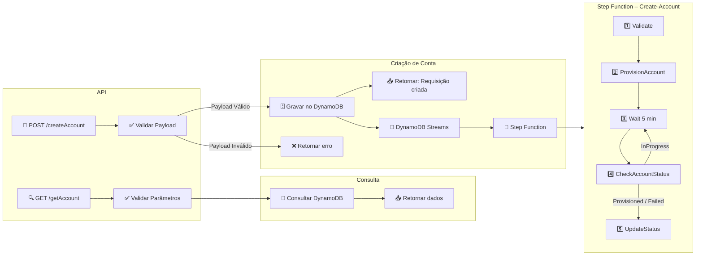

# 🧩 Automação de Criação de Contas AWS – Accounts API

Documentação completa da solução de criação e acompanhamento de contas AWS usando Control Tower / Account Factory. Este guia descreve endpoints, dados, lambdas, Step Function, infraestrutura Terraform e práticas operacionais.

---

## Sumário
1. [Visão Geral e Objetivos](#1-visão-geral-e-objetivos)  
2. [Arquitetura e Fluxo](#2-arquitetura-e-fluxo)  
3. [Endpoints da API](#3-endpoints-da-api)  
4. [Modelo de Dados – DynamoDB](#4-modelo-de-dados--dynamodb)  
5. [Lambdas e Responsabilidades](#5-lambdas-e-responsabilidades)  
6. [Step Function](#6-step-function)  
7. [Infraestrutura Terraform](#7-infraestrutura-terraform)  
8. [Permissões IAM](#8-permissões-iam)  
9. [Operação e Boas Práticas](#9-operação-e-boas-práticas)  
10. [Fluxo de Desenvolvimento](#10-fluxo-de-desenvolvimento)

---

## 1. Visão Geral e Objetivos
- Expor um endpoint HTTP simples para solicitar criação de contas AWS.
- Persistir requisições em DynamoDB (`AccountsTable`) e iniciar a Step Function automaticamente via Streams.
- Executar validações (payload, OU, duplicidade), provisionar via Service Catalog e atualizar status/timestamps até `Provisioned` ou `Failed`.

---

## 2. Arquitetura e Fluxo



---

## 3. Endpoints da API
Base: API Gateway → Lambda (`lambda_src/api/lambda_function.py`).

### POST `/createAccount`
- Valida payload com campos obrigatórios (`AccountEmail`, `AccountName`, `OrgUnit`, `SSOUser*`).  
- Verifica OU via Organizations, checa duplicidade, grava item no DynamoDB com `Status=Requested`.  
- Respostas: `201 Created`, `400 Bad Request`, `409 Conflict`, `500 Internal Server Error`.  
- Payloads suportam OU simples (`"Engineering"`) ou completas (`"Engineering/Platform/Dev"`).

### GET `/getAccount`
- Busca por `accountEmail` (recomendado) ou `accountId`.  
- Respostas: `200 OK`, `400 Bad Request`, `404 Not Found`.  
- Usa `table.get_item` para email e `table.scan` para AccountId.

**Regras gerais**
- Emails e nomes chave são normalizados para lowercase/capitalizado.  
- DynamoDB usa `ConditionExpression` para evitar sobrescrita.  
- OrgUnit requer caminho completo, separando com `/`.

---

## 4. Modelo de Dados – DynamoDB (`AccountsTable`)
- PK: `AccountEmail` (lowercase).  
- Atributos principais: `AccountName`, `SSOUserEmail`, `SSOUserFirstName`, `SSOUserLastName`, `OrgUnit`, `Status`, `AccountId`, `ErrorMessage`, `RequestID`, `CreatedAt`, `UpdatedAt`, `LastUpdateDate`, `Tags`.  
- Timestamps no formato ISO8601.  
- Stream habilitado (`NEW_IMAGE`) para acionar o trigger da Step Function.

---

## 5. Lambdas e Responsabilidades

| Arquivo | Trigger | Função | Observações |
| --- | --- | --- | --- |
| `lambda_src/api/lambda_function.py` | API Gateway | GET/POST, valida payloads, escreve/le no DynamoDB, consulta Organizations | Usa `DYNAMO_TABLE`. |
| `lambda_src/accounts/trigger_sfn.py` | DynamoDB Streams (INSERT) | Inicia Step Function com itens `Status=Requested` | Requer `SFN_ARN`. |
| `lambda_src/accounts/validate_fields.py` | Step Function | Normaliza dados, valida emails, OU, duplicidade no Dynamo e Organizations | Levanta exceções com `account_email` para rastreio. |
| `lambda_src/accounts/provision_account.py` | Step Function | Interage com Service Catalog (Account Factory), garante associação da role de provisionamento ao portfólio e salva `ProvisionedProductId` no Dynamo | Usa env `PRINCIPAL_ARN`, atualiza `Status=IN_PROCESSING`. |
| `lambda_src/accounts/check_account_status.py` | Step Function (loop) | Consulta `describe_provisioned_product`, mantém status atualizado | Trata `UNDER_CHANGE` e envia erros para o catch. |
| `lambda_src/accounts/update_succeed_status.py` | Step Function (sucesso) | Busca `AccountId` via `get_provisioned_product_outputs`, marca `Status=ACTIVE` | Atualiza `AccountId` + timestamps. |
| `lambda_src/accounts/update_failed_status.py` | Step Function (erro) | Extrai `account_email` do erro, marca ou remove item no Dynamo | Atualmente remove registro (`delete_item`); pode ser ajustado para `Status=Failed`. |


---

## 6. Step Function
Workflow `Create-Account`:
1. **Validate** – valida campos/OU/duplicidade.  
2. **ProvisionAccount** – chama Service Catalog, salva IDs e status.  
3. **Wait / CheckAccountStatus** – aguarda e revalida status (loop).  
4. **UpdateStatusSuccess** – atualiza Dynamo com AccountId e `Status=ACTIVE`.  
5. **UpdateStatusFailed** – aciona Lambda que registra/limpa entradas em caso de erro.

Diretrizes:
- Ajustar `Wait`/retries conforme SLA.  
- Usar `Catch` para encaminhar quaisquer erros ao nó `UpdateStatusFailed` com payload do erro (`Cause`, `account_email`).  
- Analisar logs do CloudWatch para cada Lambda (default `INFO`).

---

## 7. Infraestrutura Terraform

```
terraform/
├── main-api.tf        # DynamoDB, Lambda API, módulo API Gateway
├── main-sfn.tf        # IAM roles (validação, provisionamento, DDB/SFN, launch role), Lambdas, Step Function
├── data.tf            # locals (prefix, caminhos), data sources e variáveis globais
├── providers.tf       # providers e versões
└── modules/
    └── apigw/         # API Gateway (logs, stage, Lambda permission, VPC endpoint opcional)
```

### Módulo `modules/apigw`
- Suporte a API pública (`endpoint_type = REGIONAL/EDGE`) ou privada (`vpc_id`, `vpc_subnet_ids`, `vpc_allowed_cidrs`).  
- Cria Security Group dedicado permitindo porta 443 apenas para os CIDRs fornecidos e associa ao `aws_vpc_endpoint` (Interface).  
- Configura CloudWatch Logs, role para `apigateway.amazonaws.com`, permissões `lambda:InvokeFunction`, e stage com `access_log_settings`.  
- Outputs: `rest_api_id`, `invoke_url`, `stage_arn`, `vpc_endpoint_id`.

Variáveis úteis (definidas em `terraform/variables.tf`):  
`aws_region`, `api_gateway_vpc_id`, `api_gateway_vpc_subnet_ids`, `api_gateway_vpc_allowed_cidrs`.

---

## 8. Permissões IAM
- Lambda API: DynamoDB (`GetItem`, `PutItem`, `Scan`, `Query`) + Organizations (`ListRoots`, `ListOrganizationalUnitsForParent`).  
- Trigger: `states:StartExecution`.  
- Atualização de falhas: `dynamodb:DeleteItem` (ou `UpdateItem`).  
- Provisionamento: Service Catalog (`ProvisionProduct`, `DescribeProduct`, etc.), Control Tower (`CreateManagedAccount`), IAM/SSO (criação e `PassRole`) concentrados na `lambda_provisioning_role`.  
- Step Function tem role própria para invocar as Lambdas.  
- Módulo API Gateway cria role para enviar logs ao CloudWatch.

---

## 9. Operação e Boas Práticas
- **Monitoramento**: manter métricas/tags no DynamoDB e logs no CloudWatch (API Gateway + Lambdas). Considerar métricas customizadas (futuro).  
- **Auditoria**: por padrão `update_failed_status` remove registros; para compliance, considere alterar para `Status=Failed` + `ErrorMessage`.  
- **Parâmetros**: usar `DYNAMO_TABLE` e demais env vars definidos no Terraform para consistência.  
- **Endpoints privados**: sempre definir `api_gateway_vpc_allowed_cidrs` ao usar `api_gateway_vpc_id`.  
- **Backups**: habilitar backups automáticos na tabela DynamoDB se exigido.  
- **Retries**: ajustar `Wait` e `Retry` nos estados do Step Function para evitar loops excessivos.

---

## 10. Fluxo de Desenvolvimento
1. **Instalação**: `python3 -m pip install --user --break-system-packages -r requirements-dev.txt`.  
2. **Lint + Testes**: `make test` (executa `scripts/lint.sh` com Ruff/Black e `python3 -m pytest`).  
3. **Infra**: `make tf-plan` e `make tf-apply` dentro de `terraform/`.  
4. **Testes manuais**: usar `test_awscurl.sh` para enviar POST/GET rapidamente (ajuste payload e Gateway ID).  
5. **Observabilidade**: conferir logs dos Lambdas/Step Function no CloudWatch após alterações.

---

Para quaisquer atualizações ou extensões (ex.: notificações, auditoria avançada), mantenha este documento sincronizado com o código e com `API.md`, garantindo que novos colaboradores tenham um caminho claro de entendimento e operação.***
